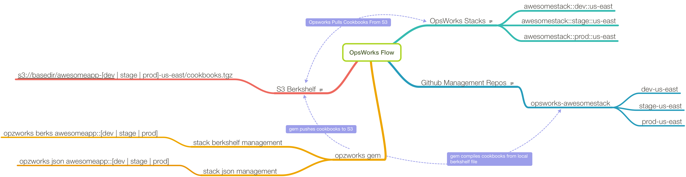

# OpzWorks CLI

Command line interface providing a workflow for interacting with AWS OpsWorks chef cookbooks, and
other useful tools like ssh.

## Build Status

[](https://circleci.com/gh/mapzen/opzworks)

## Third party requirements:

Aside from a recent version of ruby:

* git
* [ChefDK](https://downloads.chef.io/chef-dk/)

## Installation

Install for use on the command line (requires ruby and rubygems): `gem install opzworks`

Then run `opzworks --help`

To use the gem in a project, add `gem 'opzworks'` to your Gemfile, and then execute: `bundle`

To build locally from this repository: `rake install`

## Commands

Run `opzworks` with one of the following commands:

#### ssh

  Generate and update SSH configuration files.

  Host names are based off the stack naming convention, `project_name::env::region`

  For example, if we have a host 'api1' in the stack apiaxle::prod::us-east, the
  resultant hostname will be `api1-apiaxle-prod-us-east`

  By default, `opsworks ssh` will iterate over all stacks. If you wish to restrict the stacks
  it searches, simply pass the stack name (or a partial match) as an argument:

    `opzworks ssh myproject::prod`

  If you wanted to automatically scrape all your stacks to populate your ssh config, and
  you don't want to use the `--update` flag (which will overwrite the entire file contents),
  you could do something like:

  Add a crontab entry similar to: `0 * * * * /bin/bash -l -c /path/to/opzworks-ssh.sh`
  Create `/path/to/opzworks-ssh.sh`:

    ```bash
    # this script reads .ssh/config, drops anything after the matched line,
    #   then generates a list of opsworks hosts and appends them to the file.
    gsed -i '/OPSWORKS_CRON_LINE_MATCH/q' ~/.ssh/config
    opzworks ssh >>~/.ssh/config
    ```

  Note this example assumes the use of a gnu sed-like utility, which on OSX means
  installing gnu sed (`brew install gsed` if you're using homebrew). On Linux, simply
  change `gsed` to `sed`.

  Add the following line to the bottom of your existing ~/.ssh/config:

    `# OPSWORKS_CRON_LINE_MATCH`

#### elastic

  Perform [start|stop|bounce|rolling] operations on an Elastic cluster.

  The host from which this command is originated will need to have access to the the target
  systems via private IP and assumes port 9200 is open and available.

  This is a very rough implementation!

#### json

  Update stack custom JSON.

#### berks

  Build the berkshelf for a stack, upload the tarball to S3, trigger `update_custom_cookbooks` on the stack.

## Configuration

The gem reads information from `~/.aws/config`, or from the file referenced by
the `AWS_CONFIG_FILE` environment variable. It should already look something like this:

    [default]
    aws_access_key_id     = ilmiochiaveID
    aws_secret_access_key = ilmiochiavesegreto
    region                = us-east-1
    output                = json

If you want the gem to read from an environment other than 'default', you can do so
by exporting the `AWS_PROFILE` environment variable. It should be set to whatever profile
name you have defined that you want to use in the config file.

Add the following section to `~/.aws/config`:

    [opzworks]
    ssh-user-name         = <MY SSH USER NAME>
    berks-repository-path = <PATH TO OPSWORKS BERKSHELF REPOSITORIES>
    berks-s3-bucket       = <AN EXISTING S3 BUCKET>

The `ssh-user-name` value should be set to the username you want to use when
logging in remotely, most probably the user name from your _My Settings_ page
in OpsWorks.

The `berks-repository-path` should point to a base directory in which your opsworks
git repositories for each stack will live.

The `berks-s3-bucket` will default to 'opzworks' if not set. You need to create the
the bucket manually (e.g. `aws s3 mb s3://opsworks-cookbook-bucket`).

Additional option are:

`berks-base-path`, which is the temporary base directory where the berkshelf will be
built. Defaults to /tmp.

`berks-tarball-name`, which is the name of the tarball that will be uploaded to S3. Defaults to cookbooks.tgz.

## Setup Conventions/Workflow for Berks/JSON Commands



This gem makes a number of assumptions in order to enforce a specific workflow. First among them is
the Opsworks stack naming convection. This will need to adhere toe the following format:

    PROJECT::ENV::REGION

If PROJECT will be comprised of multiple words, they should be joined with underscores, e.g.

    my_awesome_rails_app::prod::us-east

So for example, if you have an Elastic cluster in dev and prod in us-east, and dev in us-west:

    elastic::dev::us-east
    elastic::dev::us-west
    elastic::prod::us-east

The next workflow that must be conformed to is berkshelf management. In this context, that means a git
repository that conforms to the following setup:

    opsworks-project

Inside that repository, you will have branches that match each of your environments and regions.

So in our Elastic example, you would have the following setup:

* a git repository called opsworks-elastic
* branches in that repository called dev-us-east, dev-us-west and prod-us-east

In each of those branches, you should have the following:

* Berksfile
* stack.json (if you want to maintain the stack json using the `opzworks json` utility)

The Berksfile will look similar to the following. If you're familiar with Berkshelf, there's nothing
new here:

```ruby
source 'https://api.berkshelf.com'

# opsworks
cookbook 'apache2' , github: 'aws/opsworks-cookbooks' , branch: 'release-chef-11.10' , rel: 'apache2'

# external
#
cookbook 'lvm',           '= 1.0.8'
cookbook 'sensu',         '= 2.10.0'
cookbook 'runit',         '= 1.5.10'
cookbook 'java',          '= 1.29.0'
cookbook 'nodejs',        '= 2.1.0'
cookbook 'elasticsearch', '= 0.3.13'
cookbook 'chef_handler',  '= 1.1.6'

# mapzen wrappers
#
cookbook 'mapzen_sensu_clients',  git: 'git@github.com:mapzen/chef-mapzen_sensu_clients', tag: '0.12.0'
cookbook 'mapzen_elasticsearch',  git: 'git@github.com:mapzen/chef-mapzen_elasticsearch', tag: '0.16.3'
cookbook 'mapzen_logstash',       git: 'git@github.com:mapzen/chef-mapzen_logstash',      tag: '0.13.1'
cookbook 'mapzen_graphite',       git: 'git@github.com:mapzen/chef-mapzen_graphite',      tag: '0.6.0'
cookbook 'mapzen_pelias',         git: 'git@github.com:mapzen/chef-mapzen_pelias',        tag: '0.34.2'
```

If we placed that Berkshelf file in opsworks-elastic, in the prod-us-east branch, we would run `opzworks berks elastic::prod::us-east`, which would do the following:

* build the berkshelf locally
* push the resultant cookbook tarball to: s3://opzworks/elastic-prod-us-east/cookbooks.tgz
* run `update_custom_cookbook` on the stack (unless you pass the --no-update flag)

Your stack should be configured to use a berkshelf from an S3 archive. The url will look as below:

    https://s3.amazonaws.com/opzworks/elastic-prod-us-east/cookbooks.tgz

You'll need to set up an IAM user or users with permission to access the location.

## Contributing

1. Fork it
2. Create your feature branch (`git checkout -b my-new-feature`)
3. Commit your changes (`git commit -am 'Add some feature'`)
4. Push to the branch (`git push origin my-new-feature`)
5. Create new Pull Request
